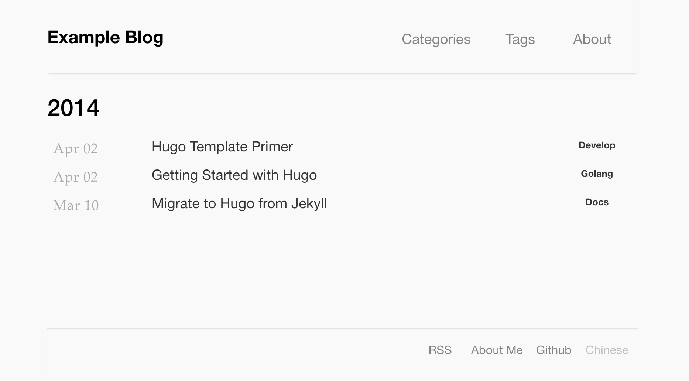

# Puff

Puff is a black-white theme for [Hugo](https://gohugo.io/).

## Feature

- minimalist
- multi-language support
- [Google Analytics](https://developers.google.com/analytics) support
- [disqus](https://disqus.com) support

## Screenshot



## Usage

Create new hugo site

```shell
hugo new site my-demo-site
```

Change `hugo.toml`:

```toml
[module]
  [[module.imports]]
    path = "github.com/stuarthua/hugo-theme-puff"
```

download hugo theme

```shell
hugo mod init my-demo-site.local
hugo mod tidy
```

run your site

```shell
hugo server
```

## Configuration

### Main section

Set your main section:

```toml
[params]
mainSections = ["posts", "categories", "tags"]
```

### Gallery

You can create a gallery page by creating a content file in the `content/gallery/` directory with a `gallery` array in the front matter. Each item in the array should have a `url` field for the image location and a `name` field for the image description:

```yaml
---
title: "My Gallery"
date: 2023-01-01
draft: false
gallery:
  - name: "Image 1 Description"
    url: "https://www.stuarthua.com"
    img: "/images/image1.jpg"
  - name: "Image 2 Description"
    url: "https://www.stuarthua.com"
    img: "/images/image2.jpg"
---
```

### Menu

Set your menu:

```toml
[menu]
  [[menu.main]]
    identifier = "gallery"
    url = "/gallery/"
    name = "gallery"
    title = "Gallery"
    weight = 1
  [[menu.main]]
    identifier = "categories"
    url = "/categories/"
    name = "categories"
    title = "Categories"
    weight = 10
  [[menu.main]]
    identifier = "tag"
    url = "/tags/"
    name = "tags"
    title = "Tags"
    weight = 20
  [[menu.main]]
    identifier = "about"
    url = "/about/"
    name = "about"
    title = "About"
    weight = 30
```

### Multi-Language

```toml
[languages]
  [languages.en]
    contentDir = "content/en"
    weight = 1
  [languages.cn]
    contentDir = "content/cn"
    weight = 2
```

Then your posts files should be put into `content/en` or `content/cn`.

### Footer

Tips: `name` support i18n

```toml
[[params.socials]]
name = "rss"
link = "/index.xml"
[[params.socials]]
name = "About"
link = "https://stuarthua.com"
[[params.socials]]
name = "Github"
link = "https://github.com/stuarthua"
```

### Extra Head

```toml
[params]
extraHead = '<script src="xxxx.js"></script>'
```

### Twitter Cards

Add the following setting:

```toml
[params]
twitterCards = true
```

In a post's front matter, include a keyword `images` with a value of a list of
URLs of images that will be used for Twitter Cards.

### Lazy Image

Lazy load image:

```toml
[params]
lazyImage = true
```

### Insert content on every post

```toml
[params]
postHeaderContent = ""
postFooterContent = "<br/><br/><p>Subscribe：<a target='_blank' href='https://mailchi.mp/a1a0d59e7a19/xxx'>Your Site</a></p>"
```

### Example

```toml
baseURL = "https://stuarthua.com/"
title = "Stuart Hua's Blog"
languageCode = "en-us"
DefaultContentLanguage = "cn"

[module]
  [[module.imports]]
    path = "github.com/stuarthua/hugo-theme-puff"

[languages]
  [languages.en]
    contentDir = "content/en"
    weight = 1
  [languages.cn]
    contentDir = "content/cn"
    weight = 1

[menu]
  [[menu.main]]
    identifier = "gallery"
    url = "/gallery/"
    name = "gallery"
    weight = 1
  [[menu.main]]
    identifier = "categories"
    url = "/categories/"
    name = "categories"
    weight = 10
  [[menu.main]]
    identifier = "tag"
    url = "/tags/"
    name = "tags"
    weight = 20
  [[menu.main]]
    identifier = "about"
    url = "/about/"
    name = "about"
    weight = 30

[services]
  [services.googleAnalytics]
    id = 'G-xxxxxx' # google analytics code
  [services.disqus]
    shortname = 'your_disqus_name' # disqus account name

[privacy]
  [privacy.googleAnalytics]
    disable = false
    respectDoNotTrack = false
  [privacy.disqus]
    disable = false
  [privacy.twitter]
    disable = false
    enableDNT = false
    simple = false
  [privacy.x]
    disable = false
    enableDNT = false
    simple = false

[params]
# favicon = "/images/logo.png"
description = 'Example Website Description'
mainSections = ["posts", "categories", "tags"]
extraHead = ''
extraBody = ''
postHeaderContent = ''
postFooterContent = ''
lazyImage = true
twitterCards = true
  [params.author]
    name = "stuarthua"
    homepage = "https://stuarthua.com/"
  [[params.socials]]
    name = "rss"
    link = "/index.xml"
  [[params.socials]]
   name = "About"
   link = "https://stuarthua.com"
  [[params.socials]]
   name = "Github"
   link = "https://github.com/stuarthua"
```

## Development

settings use local theme folder

```shell
cd exampleSite

hugo mod init my-site.local
hugo mod tidy
```

edit `go.mod` file: use `replace` command to local folder. add connect:

```go
replace github.com/stuarthua/hugo-theme-puff => ../
```

run server

```shell
hugo server
```
